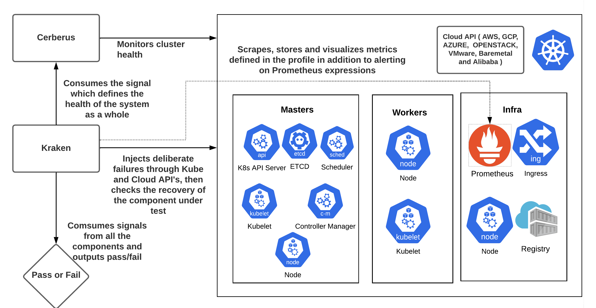

# Kraken
Chaos and resiliency testing tool for Kubernetes and OpenShift

Kraken injects deliberate failures into Kubernetes/OpenShift clusters to check if it is resilient to failures.

### Workflow


### Install the dependencies
```
$ pip3 install -r requirements.txt
```

### Usage

#### Config
Set the scenarios to inject and the tunings like duration to wait between each scenario in the config file located at config/config.yaml. Kraken uses [powerfulseal](https://github.com/bloomberg/powerfulseal) tool for pod based scenarios, a sample config looks like:

```
kraken:
    kubeconfig_path: /root/.kube/config                    # Path to kubeconfig
    scenarios:                                             # List of policies/chaos scenarios to load
        -    scenarios/etcd.yml
        -    scenarios/openshift-kube-apiserver.yml                           
        -    scenarios/openshift-apiserver.yml

tunings:
    wait_duration: 60                                      # Duration to wait between each chaos scenario 
```

#### Run
```
$ python3 run_kraken.py --config <config_file_location>
```

#### Run containerized version
Assuming that the latest docker ( 17.05 or greater with multi-build support ) is intalled on the host, run:
```
$ docker pull quay.io/openshift-scale/kraken:latest
$ docker run --name=kraken --net=host -v <path_to_kubeconfig>:/root/.kube/config -v <path_to_kraken_config>:/root/kraken/config/config.yaml -d quay.io/openshift-scale/kraken:latest
$ docker logs -f kraken
```

Similarly, podman can be used to achieve the same:
```
$ podman pull quay.io/openshift-scale/kraken
$ podman run --name=kraken --net=host -v <path_to_kubeconfig>:/root/.kube/config:Z -v <path_to_kraken_config>:/root/kraken/config/config.yaml:Z -d quay.io/openshift-scale/kraken:latest
$ podman logs -f kraken
```

If you want to build your own kraken image see [here](https://github.com/openshift-scale/kraken/tree/master/containers/build_own_image-README.md)

#### Report
The report is generated in the run directory and it contains the information about each chaos scenario injection along with timestamps.

#### Cerberus to help with cluster health checks
[Cerberus](https://github.com/openshift-scale/cerberus) can be used to monitor the cluster under test and the aggregated go/no-go signal generated by it can be consumed by Kraken to determine pass/fail. This is to make sure the Kubernetes/OpenShift environments are healthy on a cluster level instead of just the targeted components level. It is highly recommended to turn on the Cerberus health check feature avaliable in Kraken after installing and setting up Cerberus. To do that, set cerberus_enabled to True and cerberus_url to the url where Cerberus publishes go/no-go signal in the config file.

### Kubernetes/OpenShift chaos scenarios supported
Following are the components of Kubernetes/OpenShift for which a basic chaos scenario config exists today. It currently just supports pod based scenarios, we will be adding more soon. Adding a new pod based scenario is as simple as adding a new config under scenarios directory and defining it in the config.

Component                | Description                                                                                        | Working
------------------------ | ---------------------------------------------------------------------------------------------------| ------------------------- |
Etcd                     | Kills a single/multiple etcd replicas for the specified number of times in a loop                  | :heavy_check_mark:        |
Kube ApiServer           | Kills a single/multiple kube-apiserver replicas for the specified number of times in a loop        | :heavy_check_mark:        |
